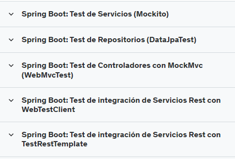

# Guía de Tipos de Pruebas y Tecnologías Utilizadas

En un proyecto de desarrollo de software, se implementan varios tipos de pruebas para asegurar que cada parte de la aplicación funcione correctamente, tanto de forma aislada como en conjunto con otros componentes. A continuación, se detallan los principales tipos de pruebas y las tecnologías comúnmente utilizadas para cada uno.

---

## 1. Pruebas Unitarias

### Descripción
Las pruebas unitarias verifican el comportamiento de métodos o funciones individuales en clases o módulos específicos, aislándolos de otros componentes. Estas pruebas son rápidas y se ejecutan sin dependencias externas. Comumente usasdas en los services.

### Tecnologías Comunes
- **JUnit**: Biblioteca de pruebas unitarias para Java, ampliamente utilizada en proyectos Spring.
- **Mockito**: Framework de mock para simular dependencias y probar la lógica interna de los métodos.
- **AssertJ**: Librería para mejorar las aserciones en Java, proporcionando una sintaxis fluida y más legible.

Se usan normalmente para testear los servicios.

---

## 2. Pruebas de Integración

### Descripción
Las pruebas de integración de componentes verifican que dos o más componentes trabajen correctamente juntos. Estas pruebas suelen centrarse en capas específicas, como controlador y servicio, o servicio y repositorio.

### Tecnologías Comunes
- **Spring Boot Test**: Proporciona un contexto de aplicación Spring para pruebas de integración.
- **MockMvc**: Herramienta para simular peticiones HTTP y probar controladores en Spring. Usado para pruebas a nivel de controlador.

Se usan tambien para comprobar todo el flujo de la petición desde el controlador hasta el repositorio.

---

# Tipos de Pruebas en Spring Boot

## Spring Boot: Test de Servicios (Mockito)

- **Tipo**: Prueba Unitaria
- **Descripción**: Estas son pruebas unitarias de la capa de servicio, en las que se utiliza **Mockito** para simular (mock) las dependencias, como los repositorios. Al "mockear" las dependencias, se pueden probar métodos específicos del servicio de forma aislada, sin necesidad de acceder a una base de datos o de cargar el contexto completo de Spring.
- **Tecnología Principal**: Mockito
- **Objetivo**: Verificar la lógica de negocio en la capa de servicio de manera aislada.

---

## Spring Boot: Test de Repositorios (DataJpaTest)

- **Tipo**: Prueba de Integración
- **Descripción**: Estas pruebas verifican el funcionamiento de la capa de persistencia (repositorios) que interactúa con la base de datos. Con **@DataJpaTest**, Spring proporciona una base de datos en memoria (como H2) para que puedas probar las consultas y operaciones CRUD sin afectar los datos reales.
- **Tecnología Principal**: @DataJpaTest
- **Objetivo**: Validar que los métodos de los repositorios (como `findAll`, `save`, `deleteById`, etc.) funcionen correctamente.

---

## Spring Boot: Test de Controladores con MockMvc (WebMvcTest)

- **Tipo**: Prueba de Integración
- **Descripción**: Este tipo de prueba permite probar la capa de controladores usando **MockMvc**. Se enfoca en probar los endpoints REST del controlador en un entorno aislado, simulando las solicitudes HTTP sin iniciar el servidor completo. **@WebMvcTest** carga solo los controladores y las configuraciones necesarias para el contexto web.
- **Tecnología Principal**: MockMvc
- **Objetivo**: Verificar que los controladores respondan correctamente a las solicitudes HTTP y devuelvan los códigos de estado y datos esperados.

---

## Spring Boot: Test de Integración de Servicios Rest con WebTestClient

- **Tipo**: Prueba de Integración
- **Descripción**: Estas son pruebas de integración completas para aplicaciones que utilizan **Spring WebFlux** (reactivo). **WebTestClient** permite enviar solicitudes HTTP y probar el flujo completo de la aplicación, interactuando con el servidor web y la base de datos en un contexto cercano al de producción.
- **Tecnología Principal**: WebTestClient
- **Objetivo**: Probar que los endpoints REST interactúen correctamente con la capa de negocio y la base de datos en una aplicación reactiva.

---

## Spring Boot: Test de Integración de Servicios Rest con TestRestTemplate

- **Tipo**: Prueba de Integración
- **Descripción**: Estas pruebas de integración son similares a las anteriores, pero para aplicaciones Spring Boot no reactivas (usando **Spring MVC** en lugar de WebFlux). **TestRestTemplate** permite realizar solicitudes HTTP reales al servidor de Spring Boot, probando el flujo completo de la aplicación en un entorno más realista.
- **Tecnología Principal**: TestRestTemplate
- **Objetivo**: Validar que la aplicación REST no reactiva funcione correctamente de extremo a extremo, incluyendo controladores, servicios y repositorios.

---